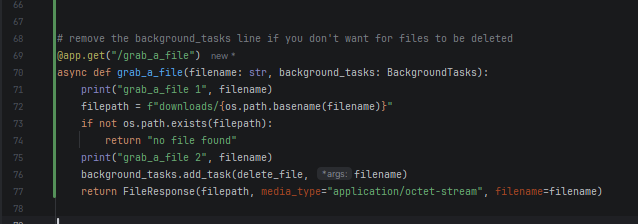

as this project uses pytubefix, i'm pretty sure it needs node.js for that automatic PoToken generation

file being called "ytmp3demo.py" is a bit of a misnomer(since it no longer is a demo), 
but i believe it has to stay this way for file history to remain on github

to stop files from being deleted, you gotta manually change `grab_a_file` function(line 76):
